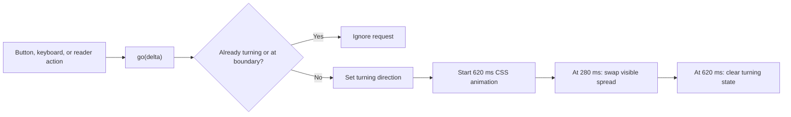

# Maestro Folio Page-Turning Implementation

## Purpose

This report describes how Maestro Folio currently calculates spreads, changes
reader state, and renders the page-turn animation. It also identifies the main
technical limitations and suggested areas for senior engineering review.

## Executive summary

The current page turn is a lightweight React/CSS transition rather than a
physics-based page curl. Navigation selects a destination spread, starts a
620 ms CSS 3D rotation, swaps the displayed spread after 280 ms, and unlocks
navigation when the animation completes.

This approach is fast, dependency-free, and predictable. It creates a convincing
book-like transition at normal viewing sizes, but the animated sheet is a
neutral gradient rather than the actual outgoing and incoming page imagery.
Previous-page navigation also uses the same leftward rotation as next-page
navigation.

## Relevant implementation

- `src/features/reader/use-reader-navigation.js`
  owns spread, animation, tilt, and fullscreen state.
- `src/features/reader/reader-geometry.js`
  maps page-array indices to book spreads.
- `src/features/reader/ReaderViews.js`
  renders the stage, visible pages, temporary turning sheet, and controls.
- `app/globals.css`
  supplies perspective, 3D transforms, paper styling, and keyframe animation.
- `app/page.js`
  connects buttons, keyboard input, bookmarks, and the reader hook.

## Page and spread model

Pages are stored in a flat ordered array. Array index `0` is treated as the
front cover. All later pages are grouped into two-page spreads:

```text
spread 0 -> page index 0 only (closed front cover)
spread 1 -> page indices 1 and 2
spread 2 -> page indices 3 and 4
spread 3 -> page indices 5 and 6
```

The maximum spread is:

```text
ceil((pageCount - 1) / 2)
```

The geometry helpers clamp all spread values to valid bounds. An incomplete
final spread renders only its left page. A page selected from the sidebar maps
back to its containing spread with `ceil(pageIndex / 2)`.

## Navigation state flow

Page navigation enters through `go(delta)`, where `delta` is `1` for next and
`-1` for previous.

1. Navigation is rejected while another turn is active.
2. The proposed spread is clamped between the cover and final spread.
3. If the proposed spread equals the current spread, no action occurs.
4. `turning` becomes `"next"` or `"prev"`.
5. After 280 ms, React updates the visible spread.
6. After 620 ms, `turning` becomes `false` and navigation unlocks.

Timers are cleared when the reader hook unmounts. This prevents delayed state
updates after the component has been removed.



## Rendering structure

The stage uses `perspective: 1400px`. The book wrapper preserves 3D transforms
and can be tilted by pointer dragging.

The book contains:

- left and right visible page elements;
- decorative page stacks behind each side;
- a central spine highlight;
- an optional temporary `.turning-page`;
- page-number overlays.

The wrapper aspect ratio is measured from the loaded left-page image. It is
calculated as twice the single-page aspect ratio and clamped between `1.1` and
`2.2`. Page images use `object-fit: contain`, preserving notation without
cropping.

## Turn animation

While `turning` is truthy, React inserts a half-width sheet positioned over the
right side of the book:

```css
.turning-page {
  left: 50%;
  width: 50%;
  transform-origin: left;
  transform-style: preserve-3d;
  animation: flip-page .62s cubic-bezier(.58,.04,.32,.98) forwards;
}
```

The sheet rotates around the spine:

```text
0%   -> rotateY(0)
45%  -> rotateY(-92deg) translateZ(22px)
100% -> rotateY(-180deg)
```

The temporary front and back faces use different paper gradients with
`backface-visibility: hidden`. At approximately the midpoint, the sheet is
edge-on and React changes the underlying spread. The timing hides most of the
content swap.

Reduced-motion preferences disable the 3D motion through the global
accessibility stylesheet.

## Input paths

The same navigation function is used by:

- previous and next reader buttons;
- left and right arrow keys;
- other reader actions wired through the main application.

Direct page and bookmark jumps set the destination spread immediately and do
not currently animate through intermediate pages.

Navigation buttons are disabled at the first and last spread. Global arrow-key
navigation is suppressed while focus is in an input, button, select, tab, text
area, editable region, or modal.

## Interaction with stable page IDs

The reader itself navigates by numeric spread. Bookmarks persist stable page
IDs and resolve those IDs back to spreads at runtime. When pages are reordered,
the application records the currently visible page ID, moves the page, then
recalculates the spread containing that ID. This keeps the reader near the same
musical location after editing.

## Current strengths

- Small implementation with no animation dependency.
- Deterministic duration and state transitions.
- Boundary checks prevent invalid spreads.
- Repeated navigation is locked during animation.
- Odd page counts and cover-only books are supported.
- Page proportions are preserved.
- Pointer tilt and page rotation use GPU-friendly transforms.
- Geometry and boundary calculations have focused unit coverage.
- Reduced-motion and keyboard-navigation behavior are included.

## Current limitations

1. **The animated sheet has no score imagery.** It is a neutral paper gradient,
   so close inspection reveals that the actual page is not bending.
2. **Previous and next turns look the same.** The `"prev"` state is recorded,
   but no directional class or reverse keyframe consumes it.
3. **State and animation timing are coupled by hard-coded timers.** Changing the
   CSS duration without changing the JavaScript timers can expose the content
   swap or unlock navigation too early.
4. **No interruption or queued navigation.** Fast repeated commands are ignored
   rather than queued or completed responsively.
5. **Direct jumps are not animated.** Bookmark and thumbnail navigation changes
   spreads immediately.
6. **No physical deformation.** There is no curl mesh, dynamic shadow,
   thickness deformation, or pointer-controlled page peel.
7. **The midpoint swap is approximate.** The spread changes at 280 ms while the
   CSS animation reaches its nominal midpoint near 310 ms.
8. **Animation behavior lacks visual regression coverage.** Geometry is tested,
   but animation direction, midpoint composition, and different page shapes
   are not captured automatically.

## Recommended review decisions

The senior engineer should first decide which visual fidelity tier the product
requires:

### Option A — Refine the current CSS approach

Recommended for a near-term beta. Render actual outgoing/incoming page images
on the turning sheet, add distinct next/previous keyframes, and drive the spread
swap from an animation event or shared timing constant.

### Option B — Layered CSS page curl

Add multiple narrow vertical strips with progressive rotation and shading. This
creates a curl without WebGL, but increases DOM complexity and requires careful
performance testing on tablets.

### Option C — Canvas/WebGL page mesh

Render the page as a deformable mesh with dynamic lighting and shadows. This
offers the highest fidelity and interactive page peeling, but introduces a
substantial rendering subsystem, texture lifecycle work, accessibility
fallbacks, and device-specific performance risk.

## Recommended next implementation

For the current product stage, Option A is the best tradeoff:

1. Pass outgoing and incoming page data into a dedicated turn model.
2. Render real page imagery on the front and back of the rotating sheet.
3. Add separate forward and reverse transforms.
4. Replace independent magic numbers with shared timing constants.
5. Use `animationiteration`/`animationend` or explicit phase state for swaps.
6. Add tests for rapid input, reduced motion, odd final spreads, and direction.
7. Add visual snapshots at start, midpoint, and completion.

This would materially improve realism and correctness without committing the
application to a WebGL page-curl engine.
